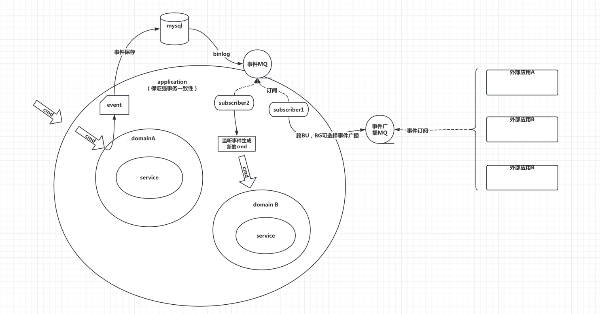

## banana-event-start简述
DDD的实践是离不开领域事件的，聚合的操作都需要保证一致性，所以我们一般在application层的调用添加事务注解（以mysql事务为例）。
当我们遇到聚合间操作的场景时，如果把两个聚合的操作都放在来application层，会导致两个严重的问题。  
1、聚合之间本身是没有强一致性约束的（如果有可能存在建模不合理的情况），多个聚合操作放在一起会导致系统耦合。     
2、多个聚合操作放在一起会扩大事务范围，大事务往往会导致更严重的资源竞争出现，进而影响系统性能。   

但是在实践DDD的时候，怎么去发布、消费、处理事件呢？  
banana-event可以提供通用的事件发布、订阅、处理能力，给大伙参考。  

### 事件发布处理流程
1、命令请求进入application层；  
2、application编排业务流程，调用领域层处理命令；  
3、命令执行完成，发布领域事件；  
4、领域事件落库到mysql；  
5、mysql使用binlog将事件推送到MQ；  
6、领域监听事件，进行处理  
6-1、可以将事件进一步对外进行广播（跨BU，BG）；  
6-2、将事件封装为cmd命令，传递给依赖的领域  


### 时序图

## 缺陷
### 事件的发布和业务操作的耦合
事件是在一个聚合发送过的事情，需要**在业务操作之后去发布事件**；我们需要保证事件发布和聚合操作的一致性；既事务提交则事件发布成功。
可以抽象为保证事件存储和领域模型存储的最终一致性。常用的方案如下：
（1）领域模型和消息设施共享持久化存储。
（2）领域模型的持久化存储和消息持久化存储由全局的XA事务（两阶段提交）所控制。
banana-event-start使用的是方案（1）；借用mysql的事务来保证事件存储和领域模型存储的一致性；如果事件过多会有性能的风险，可以考虑将事件数据做冷热分离。
代码示例：
```java
   @Component
  public class OrderApplication {

    @Resource
    private EventCoordinator eventCoordinator;
    private Object Order;

    @Transactional(rollbackFor = Exception.class)
    public Boolean submitOrder(BusinessCmdContext<SubmitOrderCmd> orderCmd){

        // 执行提单能力
        Order order = new Order();
        // 执行业务逻辑

        // 发布事件
        if (order.submitSuccess()){
            Event event = EventFactory.newDefaultEvent(order, OrderEventEnum.SUBMIT_ORDER_SUCCESS);
            eventCoordinator.publish(event);
        } else {
            //套餐下架
            Event event = EventFactory.newDefaultEvent(order, OrderEventEnum.SUBMIT_ORDER_FAIL);
            eventCoordinator.publish(event);
        }
        return Boolean.TRUE;
    }
}

```
[参考]：《实现领域驱动设计》


## 接口说明
### com.banana.event.starter.base包
EventDomain：抽象的领域分类接口
AggregateType：聚合类型接口，每个聚合所有对应的领域
Identify：对象唯一标识接口
EventType：事件类型，每个事件由聚合触发
Event：事件
EventConsumerTask：消费方处理事件的任务信息

### 核心类
EventConsumer：事件消费者接口，使用的时候实现这个接口
EventCoordinator：事件的协调处理器，包括发布、消费事件
EventConsumerRegister：消费者注册中心，用于绑定、关联事件和消费者
EventStarter：启动类
WrapperEventConsumer：包装用户使用时实现的consumer做一些增强处理

### com.banana.event.starter.extension 扩展接口
EventRepository：事件对象的仓储接口，根据自己的需求进行实现，可以是任何存储。
ConsumerTaskRepository：消费者任务的仓储接口，用户自己实现
EventIdFactory：获取eventId的接口，默认为Long类型时间戳，用户可自己实现
EventWarning：事件预警接口，用户可在事件在发布失败、处理失败时，实现扩展预警逻辑。


## 怎么使用
具体案例参考demo
### 引入jar
```xml
<dependency>
    <groupId>org.example</groupId>
    <artifactId>banana-event-starter</artifactId>
    <version>1.0-SNAPSHOT</version>
</dependency>
```

### 实现事件和事件消费者记录的仓储
EventRepository、ConsumerTaskRepository
最好自己实现EventIdFactory和EventWarning
如果事件和消费记录使用mysql，表结构参考如下：
```sql
CREATE TABLE `xfyl_merchant_event_record` (
  `id` bigint(20) NOT NULL AUTO_INCREMENT COMMENT 'id主键',
  `event_id` bigint(20) NOT NULL COMMENT '事件ID',
  `domain_code` varchar(60) NOT NULL COMMENT '领域编号',
  `aggregate_code` varchar(60) NOT NULL COMMENT '聚合类型编码',
  `aggregate_id` varchar(512) NOT NULL COMMENT '聚合唯一标识',
  `version` int(10) DEFAULT NULL COMMENT '版本号，这个版本号是基于domain_id发布的事件版本号',
  `event_code` varchar(60) NOT NULL COMMENT '事件名称',
  `publish_time` datetime NOT NULL COMMENT '事件发布时间',
  `body` varchar(512) DEFAULT NULL COMMENT '事件主体内容',
  `consumer_ids` varchar(512) NOT NULL COMMENT '事件消费者集合',
  `yn` int(4) NOT NULL DEFAULT '1' COMMENT '逻辑状态',
  `create_time` datetime NOT NULL DEFAULT CURRENT_TIMESTAMP COMMENT '创建时间',
  `update_time` timestamp NOT NULL DEFAULT CURRENT_TIMESTAMP ON UPDATE CURRENT_TIMESTAMP,
  `score` int(10) NOT NULL COMMENT '事件分值（代表消费者的数量）',
  PRIMARY KEY (`id`) USING BTREE
) ENGINE=InnoDB AUTO_INCREMENT=0 DEFAULT CHARSET=utf8 COMMENT='事件记录表';

CREATE TABLE `event_consumer` (
  `id` bigint(20) NOT NULL AUTO_INCREMENT COMMENT 'id主键',
  `domain_code` varchar(60) NOT NULL COMMENT '事件消费者所属领域编号',
  `event_code` varchar(60) NOT NULL COMMENT '事件类型编号',
  `event_id` bigint(20) NOT NULL COMMENT '事件ID',
  `publish_time` datetime DEFAULT NULL COMMENT '事件发布时间',
  `consumer_code` varchar(60) NOT NULL COMMENT '处理器编号',
  `status` int(4) NOT NULL COMMENT '处理结果-1:处理失败，0:待消费，1:处理成功，2:失效',
  `async` int(4) NOT NULL COMMENT '是否异步执行1:异步，0:同步',
  `num` int(10) DEFAULT NULL COMMENT '执行次数',
  `yn` int(4) NOT NULL DEFAULT '1' COMMENT '逻辑状态',
  `create_time` datetime NOT NULL DEFAULT CURRENT_TIMESTAMP COMMENT '创建时间',
  `update_time` timestamp NOT NULL DEFAULT CURRENT_TIMESTAMP ON UPDATE CURRENT_TIMESTAMP COMMENT '更新时间',
  PRIMARY KEY (`id`) USING BTREE
) ENGINE=InnoDB AUTO_INCREMENT=37 DEFAULT CHARSET=utf8 COMMENT='事件消费记录表';
```

### 异步事件消费
通过MQ或者定时任务扫描消费者消费记录，调用com.banana.event.starter.EventCoordinator.disposeAsyncEvent进行异步事件处理

### 事件发布与消费注册
事件发布：com.banana.event.starter.EventCoordinator.publish
消费者注册：com.banana.event.starter.EventConsumerRegister.register


